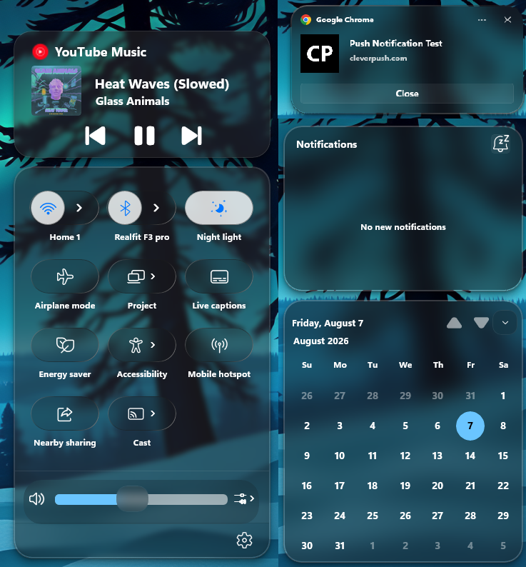
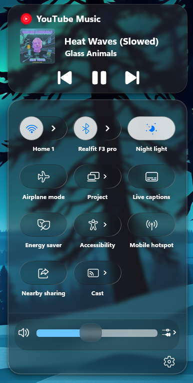
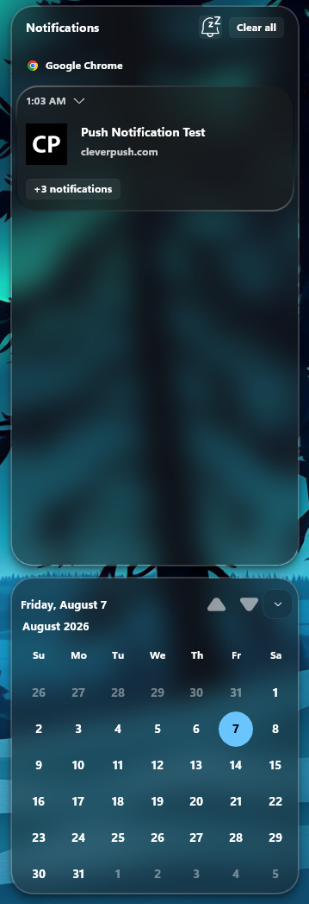
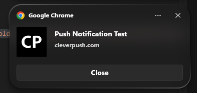

# OS26 Tahoe Glass Theme for Windows 11 Notification Center Styler

This theme is Designed to make Windows 11 Notification Center look like MacOS Tahoe. Suggestions, and Contributions are welcome!

**Author**: [WasiXGamer](https://github.com/wasixgamer)



## Previews







## Credits, and Usability

The theme is allowed be edited and distributed. If showcasing the style, or its fork, Please give credits to the Theme Author!

## Theme selection

The theme is integrated into the mod and can be selected directly from the mod's settings:

* Open the Windows 11 Notification Center Styler mod in Windhawk.
* Go to the "Settings" tab.
* Select the theme and save the settings.

## Manual installation

The theme styles can also be imported manually. To do that, follow these steps:

* Open the Windows 11 Notification Center Styler mod in Windhawk.
* Go to the "Settings" tab and select "Textual mode".
* Copy the content below to the text box and click "Save settings".

<details>
<summary>Content to import (click to expand)</summary>

```yaml
theme: OS26 Tahoe Glass (By WasiXGamer)
styleConstants:
  - ''
controlStyles:
  - target: ActionCenter.NotificationCenterPage > Grid#RootGrid > Grid#RootContent > Grid#NotificationCenterGrid
    styles:
      - CornerRadius=25
      - BorderBrush=#69878787
      - BorderThickness=2
      - Background:=<WindhawkBlur BlurAmount="16" TintColor="#761E1E1E"/>
  - target: ActionCenter.NotificationCenterPage > Grid#RootGrid > Grid#RootContent > Grid#CalendarCenterGrid
    styles:
      - BorderBrush:=#69878787
      - CornerRadius=25
      - BorderThickness=2
      - Background:=<WindhawkBlur BlurAmount="16" TintColor="#761E1E1E"/>
  - target: Windows.UI.Xaml.Controls.TextBlock
    styles:
      - FontWeight=Bold
  - target: ScrollViewer > ScrollContentPresenter > Border > Frame > ContentPresenter > ActionCenter.NotificationCenterPage > Grid#RootGrid > Grid#RootContent > Grid#NotificationCenterGrid > ActionCenter.NotificationCenterView#NotificationCenterView > Grid#MainGrid > ActionCenter.NotificationListView#MainListView > Border > ScrollViewer#ScrollViewer > Border#Root > Grid > ScrollContentPresenter#ScrollContentPresenter > ItemsPresenter > ItemsStackPanel > ActionCenter.NotificationListViewItem > Windows.UI.Xaml.Controls.Primitives.ListViewItemPresenter > ActionCenter.FlexibleItemView > Grid#MainGrid > Grid#ItemGrid > Grid > Border#ItemOpaquePlating
    styles:
      - BorderBrush:=<LinearGradientBrush EndPoint="0.40,-0.96" StartPoint="0.60,1.96"><GradientStop Color="#878787" Offset="0.24"/><GradientStop Color="#36000000" Offset="0.43"/><GradientStop Color="#2B000000" Offset="0.57"/><GradientStop Color="#878787" Offset="0.75"/></LinearGradientBrush>
      - CornerRadius=25
      - BorderThickness=2
      - Background:=<WindhawkBlur BlurAmount="16" TintColor="#761E1E1E"/>
  - target: ActionCenter.NotificationCenterPage > Grid#RootGrid > Grid#RootContent > Grid#CalendarCenterGrid > ActionCenter.ClockCalendarView#ClockCalendarView > Grid > Grid#CalendarSection > ScrollViewer#CalendarControlScrollViewer
    styles:
      - Margin=-10,-45,-10,-13
      - Width=325
      - Background=transparent
      - BorderThickness=0
  - target: ScrollViewer > ScrollContentPresenter > Border > Frame > ContentPresenter > ActionCenter.NotificationCenterPage > Grid#RootGrid > Grid#RootContent > Grid#CalendarCenterGrid > ActionCenter.ClockCalendarView#ClockCalendarView > Grid > Grid#CalendarSection > ActionCenter.FocusSessionControl#FocusSessionControl > Grid#FocusGrid
    styles:
      - Visibility=1
  - target: ActionCenter.NotificationCenterPage > Grid#RootGrid > Grid#RootContent > Grid#CalendarCenterGrid > ActionCenter.ClockCalendarView#ClockCalendarView > Grid > Grid#CalendarSection > StackPanel#CalendarHeader
    styles:
      - Canvas.ZIndex=1
      - Margin=0,5,0,-5
  - target: ActionCenter.NotificationCenterPage > Grid#RootGrid > Grid#RootContent > Grid#CalendarCenterGrid > ActionCenter.ClockCalendarView#ClockCalendarView > Grid > Grid#CalendarSection > ScrollViewer#CalendarControlScrollViewer > Border#Root > Grid > ScrollContentPresenter#ScrollContentPresenter > CalendarView#CalendarControl > Border > Grid > Grid > Button#HeaderButton > ContentPresenter#Text
    styles:
      - Background=transparent
      - CornerRadius=0
      - Width=130
      - FontSize=13
      - Margin=-48,20,48,-20
  - target: ScrollViewer > ScrollContentPresenter > Border > Frame > ContentPresenter > ActionCenter.NotificationCenterPage > Grid#RootGrid > Grid#RootContent > Grid#CalendarCenterGrid > ActionCenter.ClockCalendarView#ClockCalendarView > Grid > Grid#CalendarSection > StackPanel#CalendarHeader > Button#DateTextButton > Grid > Border#Border > ContentPresenter#ContentPresenter > TextBlock
    styles:
      - FontSize=13
      - Margin=-6,0,6,0
  - target: Microsoft.UI.Xaml.Controls.AnimatedIcon#ExpandCollapseButtonIcon
    styles:
      - FontSize=25
  - target: ActionCenter.NotificationCenterPage > Grid#RootGrid > Grid#RootContent > Grid#CalendarCenterGrid > ActionCenter.ClockCalendarView#ClockCalendarView > Grid > Grid#CalendarSection > Button#ExpandCollapseButton
    styles:
      - Background:=<WindhawkBlur BlurAmount="16" TintColor="#2D101010"/>
      - Margin=10,0,-10,0
      - CornerRadius=12
      - Width=35
      - Height=35
      - Canvas.ZIndex=1
  - target: ActionCenter.NotificationCenterPage > Grid#RootGrid > Grid#RootContent > Grid#CalendarCenterGrid > ActionCenter.ClockCalendarView#ClockCalendarView > Grid > Grid#CalendarSection > ScrollViewer#CalendarControlScrollViewer > Border#Root > Grid > ScrollContentPresenter#ScrollContentPresenter > CalendarView#CalendarControl > Border > Grid > Grid > Button#PreviousButton > ContentPresenter#Text
    styles:
      - Background=transparent
      - Margin=-10,-5,10,5
  - target: ActionCenter.NotificationCenterPage > Grid#RootGrid > Grid#RootContent > Grid#CalendarCenterGrid > ActionCenter.ClockCalendarView#ClockCalendarView > Grid > Grid#CalendarSection > ScrollViewer#CalendarControlScrollViewer > Border#Root > Grid > ScrollContentPresenter#ScrollContentPresenter > CalendarView#CalendarControl > Border > Grid > Grid > Button#PreviousButton > ContentPresenter#Text > TextBlock
    styles:
      - FontSize=20
  - target: ScrollViewer > ScrollContentPresenter > Border > Frame > ContentPresenter > ActionCenter.NotificationCenterPage > Grid#RootGrid > Grid#RootContent > Grid#CalendarCenterGrid > ActionCenter.ClockCalendarView#ClockCalendarView > Grid > Grid#CalendarSection > ScrollViewer#CalendarControlScrollViewer > Border#Root > Grid > ScrollContentPresenter#ScrollContentPresenter > CalendarView#CalendarControl > Border > Grid > Grid > Button#NextButton > ContentPresenter#Text
    styles:
      - Background=transparent
      - Margin=-25,-5,25,5
  - target: ActionCenter.NotificationCenterPage > Grid#RootGrid > Grid#RootContent > Grid#CalendarCenterGrid > ActionCenter.ClockCalendarView#ClockCalendarView > Grid > Grid#CalendarSection > ScrollViewer#CalendarControlScrollViewer > Border#Root > Grid > ScrollContentPresenter#ScrollContentPresenter > CalendarView#CalendarControl > Border > Grid > Grid > Button#NextButton > ContentPresenter#Text > TextBlock
    styles:
      - FontSize=20
  - target: ActionCenter.NotificationCenterPage > Grid#RootGrid > Grid#RootContent > Grid#CalendarCenterGrid > ActionCenter.ClockCalendarView#ClockCalendarView > Grid > Grid#CalendarSection > ScrollViewer#CalendarControlScrollViewer > Border#Root > Grid > ScrollContentPresenter#ScrollContentPresenter > CalendarView#CalendarControl > Border > Grid > Grid > Button#PreviousButton > ContentPresenter#Text
    styles:
      - FontSize=16
  - target: ControlCenter.ControlCenterPage > Grid#RootGrid > Grid#RootContent > Grid#ControlCenterRegion
    styles:
      - // [start of action center customizations]
      - // [background]
      - CornerRadius=25
      - BorderThickness=2
      - Background:=<WindhawkBlur BlurAmount="3.5" TintColor="#761E1E1E"/>
  - target: ControlCenter.ControlCenterPage > Grid#RootGrid > Grid#RootContent > ControlCenter.MediaTransportControls#MediaTransportControls > Grid#MediaTransportControlsRegion
    styles:
      - // [Music page bg]
      - CornerRadius=25
      - Background:=<WindhawkBlur BlurAmount="3.5" TintColor="#761E1E1E"/>
  - target: ScrollViewer > ScrollContentPresenter > Border > ControlCenter.ControlCenterPage > Grid#RootGrid > Grid#RootContent > ControlCenter.MediaTransportControls#MediaTransportControls > Grid#MediaTransportControlsRegion > Grid#MediaTransportControlsRoot > Grid > TextBlock#AppNameText
    styles:
      - FontSize=18
  - target: ScrollViewer > ScrollContentPresenter > Border > ControlCenter.ControlCenterPage > Grid#RootGrid > Grid#RootContent > ControlCenter.MediaTransportControls#MediaTransportControls > Grid#MediaTransportControlsRegion > Grid#MediaTransportControlsRoot > Grid > Image#IconImage
    styles:
      - Height=25
      - Width=25
  - target: ScrollViewer > ScrollContentPresenter > Border > ControlCenter.ControlCenterPage > Grid#RootGrid > Grid#RootContent > ControlCenter.MediaTransportControls#MediaTransportControls > Grid#MediaTransportControlsRegion > Grid#MediaTransportControlsRoot > Grid#AlbumTextAndArtContainer > StackPanel#PrimaryAndSecondaryTextContainer
    styles:
      - Margin=90,-5,-70,5
  - target: ScrollViewer > ScrollContentPresenter > Border > ControlCenter.ControlCenterPage > Grid#RootGrid > Grid#RootContent > ControlCenter.MediaTransportControls#MediaTransportControls > Grid#MediaTransportControlsRegion > Grid#MediaTransportControlsRoot > Grid#AlbumTextAndArtContainer > StackPanel#PrimaryAndSecondaryTextContainer > TextBlock#TitleText
    styles:
      - FontSize=19
  - target: ScrollViewer > ScrollContentPresenter > Border > ControlCenter.ControlCenterPage > Grid#RootGrid > Grid#RootContent > ControlCenter.MediaTransportControls#MediaTransportControls > Grid#MediaTransportControlsRegion > Grid#MediaTransportControlsRoot > Grid#AlbumTextAndArtContainer > StackPanel#PrimaryAndSecondaryTextContainer > TextBlock#SubtitleText
    styles:
      - FontSize=16
  - target: ControlCenter.MediaTransportControls#MediaTransportControls > Grid#MediaTransportControlsRegion > Grid#MediaTransportControlsRoot > Grid#AlbumTextAndArtContainer > Grid#ThumbnailImage
    styles:
      - Width=70
      - Height=70
      - Margin=-240,-5,240,5
      - HorizontalAlignment=left
  - target: ControlCenter.MediaTransportControls#MediaTransportControls > Grid#MediaTransportControlsRegion > Grid#MediaTransportControlsRoot > ListView#MediaButtonsListView > ItemsPresenter > StackPanel
    styles:
      - Margin=0,-10,0,-10
  - target: Windows.UI.Xaml.Controls.Primitives.RepeatButton#PreviousButton > ContentPresenter#ContentPresenter
    styles:
      - // [Previous button]
      - Margin=-10,0,-10,0
      - Height=45
      - Width=65
  - target: Windows.UI.Xaml.Controls.Primitives.RepeatButton#PreviousButton > ContentPresenter#ContentPresenter > TextBlock
    styles:
      - // [Previous button Font]
      - FontSize=30
  - target: Button#PlayPauseButton > ContentPresenter#ContentPresenter
    styles:
      - // [play button]
      - Margin=-20,0,-20,0
      - Height=45
      - Width=65
  - target: Button#PlayPauseButton > ContentPresenter#ContentPresenter > TextBlock
    styles:
      - // [play button Font]
      - FontSize=30
  - target: Windows.UI.Xaml.Controls.Primitives.RepeatButton#NextButton > ContentPresenter#ContentPresenter
    styles:
      - // [Next button]
      - Margin=-20,0,-20,0
      - Height=45
      - Width=65
  - target: Windows.UI.Xaml.Controls.Primitives.RepeatButton#NextButton > ContentPresenter#ContentPresenter > TextBlock
    styles:
      - // [Next button Font]
      - FontSize=30
  - target: ScrollViewer > ScrollContentPresenter > Border > ControlCenter.ControlCenterPage > Grid#RootGrid > Grid#RootContent > Grid#ControlCenterRegion > ControlCenter.ControlCenterView#ControlCenterView > Grid#RootGrid > Grid#L1Grid > ContentControl#SlidersGroup > ContentPresenter > GridView#RootGridView > Border > ScrollViewer#ScrollViewer > Border#Root > Grid > ScrollContentPresenter#ScrollContentPresenter > ItemsPresenter > ItemsStackPanel > GridViewItem > Windows.UI.Xaml.Controls.Primitives.ListViewItemPresenter#Root > ContentControl > ContentPresenter > ControlCenter.AccessibleItemContainer > Grid#RootGrid > ContentControl#QuickActionContentControl > ContentPresenter > Grid > ControlCenter.AsyncSlider > Grid > Grid#SliderContainer > Grid#HorizontalTemplate > Rectangle#HorizontalTrackRect
    styles:
      - RadiusX=6
      - RadiusY=6
      - Height=15
      - Margin=0,-7.5,0,7.5
  - target: ScrollViewer > ScrollContentPresenter > Border > ControlCenter.ControlCenterPage > Grid#RootGrid > Grid#RootContent > Grid#ControlCenterRegion > ControlCenter.ControlCenterView#ControlCenterView > Grid#RootGrid > Grid#L1Grid > ContentControl#SlidersGroup > ContentPresenter > GridView#RootGridView > Border > ScrollViewer#ScrollViewer > Border#Root > Grid > ScrollContentPresenter#ScrollContentPresenter > ItemsPresenter > ItemsStackPanel > GridViewItem > Windows.UI.Xaml.Controls.Primitives.ListViewItemPresenter#Root > ContentControl > ContentPresenter > ControlCenter.AccessibleItemContainer > Grid#RootGrid > ContentControl#QuickActionContentControl > ContentPresenter > Grid > ControlCenter.AsyncSlider > Grid > Grid#SliderContainer > Grid#HorizontalTemplate > Rectangle#HorizontalDecreaseRect
    styles:
      - RadiusX=6
      - RadiusY=6
      - Margin=0,-7.5,0,7.5
  - target: ss.ControlCenterPage > Grid#RootGrid > Grid#RootContent > Grid#ControlCenterRegion > ControlCenter.ControlCenterView#ControlCenterView > Grid#RootGrid > Grid#L1Grid > ContentControl#SlidersGroup > ContentPresenter > GridView#RootGridView > Border > ScrollViewer#ScrollViewer > Border#Root
    styles:
      - CornerRadius=6
      - Background:=red
      - Height=auto
  - target: ControlCenter.ControlCenterPage > Grid#RootGrid > Grid#RootContent > Grid#ControlCenterRegion > ControlCenter.ControlCenterView#ControlCenterView > Grid#RootGrid > Grid#L1Grid > ContentControl#SlidersGroup > ContentPresenter > GridView#RootGridView > Border 
    styles:
      - Background:=transparent
      - Height=auto
  - target: ControlCenter.ControlCenterPage > Grid#RootGrid > Grid#RootContent > Grid#ControlCenterRegion > ControlCenter.ControlCenterView#ControlCenterView > Grid#RootGrid > Grid#L1Grid > ContentControl#SlidersGroup > ContentPresenter > GridView#RootGridView > Border > ScrollViewer#ScrollViewer > Border#Root > Grid > ScrollContentPresenter#ScrollContentPresenter > ItemsPresenter > ItemsStackPanel > GridViewItem > Windows.UI.Xaml.Controls.Primitives.ListViewItemPresenter#Root > ContentControl > ContentPresenter > ControlCenter.AccessibleItemContainer > Grid#RootGrid > ContentControl#QuickActionContentControl > ContentPresenter > Grid > ControlCenter.AsyncSlider > Grid > Grid#SliderContainer > Grid#HorizontalTemplate > Windows.UI.Xaml.Controls.Primitives.Thumb#HorizontalThumb
    styles:
      - Margin=0,-7.5,5,7.5
      - Height=35
      - Width=45
  - target: GridViewItem > Windows.UI.Xaml.Controls.Primitives.ListViewItemPresenter#Root > ContentControl > ContentPresenter > Grid > Grid > ControlCenter.PaginatedToggleButton#ToggleButton > ContentPresenter#ContentPresenter@CommonStates
    styles:
      - CornerRadius=25
      - Foreground@Checked:=#0076FF
      - Foreground@CheckedPointerOver:=#0076FF
      - Foreground@CheckedPressed:=#0076FF
      - Foreground@CheckedDisabled:=#0076FF
      - Background@Normal:=<WindhawkBlur BlurAmount="8" TintColor="#2D101010"/>
      - Background@PointerOver:=<WindhawkBlur BlurAmount="8" TintColor="#2D101010"/>
      - Background@Pressed:=<WindhawkBlur BlurAmount="8" TintColor="#2D101010"/>
      - Background@Disabled:=<WindhawkBlur BlurAmount="8" TintColor="#2D101010"/>
      - Background@Checked:=<WindhawkBlur BlurAmount="8" TintColor="#78ffffff" TintOpacity="0.8"/>
      - Background@CheckedPointerOver:=<WindhawkBlur BlurAmount="8" TintColor="#78ffffff" TintOpacity="0.8"/>
      - Background@CheckedPressed:=<WindhawkBlur BlurAmount="8" TintColor="#78ffffff" TintOpacity="0.8"/>
      - Background@CheckedDisabled:=<WindhawkBlur BlurAmount="8" TintColor="#78ffffff" TintOpacity="0.8"/>
      - BorderBrush:=<LinearGradientBrush EndPoint="1.04,1.11" StartPoint="-0.02,-0.12"><GradientStop Color="#8A878787" Offset="0.13"/><GradientStop Color="#691C1C1C" Offset="0.3"/><GradientStop Color="#871C1C1C" Offset="0.67"/><GradientStop Color="#878787" Offset="0.9"/></LinearGradientBrush>
  - target: GridViewItem > Windows.UI.Xaml.Controls.Primitives.ListViewItemPresenter#Root > ContentControl > ContentPresenter > StackPanel > ContentControl > ContentPresenter > Grid > Grid > ControlCenter.PaginatedToggleButton#ToggleButton > ContentPresenter#ContentPresenter
    styles:
      - CornerRadius=25
      - Background:=<WindhawkBlur BlurAmount="8" TintColor="#2D101010"/>
      - BorderBrush:=<LinearGradientBrush EndPoint="1.04,1.11" StartPoint="-0.02,-0.12"><GradientStop Color="#8A878787" Offset="0.13"/><GradientStop Color="#691C1C1C" Offset="0.3"/><GradientStop Color="#871C1C1C" Offset="0.67"/><GradientStop Color="#878787" Offset="0.9"/></LinearGradientBrush>
  - target: Microsoft.UI.Xaml.Controls.PipsPager#QuickActionsPager
    styles:
      - Visibility=1
  - target: Grid#ControlCenterRegion > ControlCenter.ControlCenterView#ControlCenterView > Grid#RootGrid > Grid#L1Grid > ContentControl#SlidersGroup > ContentPresenter > GridView#RootGridView > Border > ScrollViewer#ScrollViewer > Border#Root > Grid > ScrollContentPresenter#ScrollContentPresenter > ItemsPresenter > ItemsStackPanel > GridViewItem > Windows.UI.Xaml.Controls.Primitives.ListViewItemPresenter#Root > ContentControl > ContentPresenter > ControlCenter.AccessibleItemContainer > Grid#RootGrid > ContentControl#QuickActionContentControl > ContentPresenter > Grid > ControlCenter.AsyncSlider > Grid > Grid#SliderContainer > Grid#HorizontalTemplate > Windows.UI.Xaml.Controls.Primitives.Thumb#HorizontalThumb > Border > Windows.UI.Xaml.Shapes.Ellipse#SliderInnerThumb
    styles:
      - Visibility=1
  - target: ScrollViewer > ScrollContentPresenter > Border > ControlCenter.ControlCenterPage > Grid#RootGrid > Grid#RootContent > Grid#ControlCenterRegion > ControlCenter.ControlCenterView#ControlCenterView > Grid#RootGrid > Grid#L1Grid > ContentControl#SlidersGroup > ContentPresenter > GridView#RootGridView > Border > ScrollViewer#ScrollViewer > Border#Root > Grid > ScrollContentPresenter#ScrollContentPresenter > ItemsPresenter > ItemsStackPanel > GridViewItem > Windows.UI.Xaml.Controls.Primitives.ListViewItemPresenter#Root > ContentControl > ContentPresenter > ControlCenter.AccessibleItemContainer > Grid#RootGrid > ContentControl#QuickActionContentControl > ContentPresenter > Grid > ControlCenter.AsyncSlider > Grid > Grid#SliderContainer > Grid#HorizontalTemplate > Windows.UI.Xaml.Controls.Primitives.Thumb#HorizontalThumb > Border
    styles:
      - CornerRadius=16
      - Background:=<WindhawkBlur BlurAmount="8" TintColor="#2D101010"/>
  - target: ControlCenter.ControlCenterPage > Grid#RootGrid > Grid#RootContent > Grid#ControlCenterRegion
    styles:
      - Height=Auto
  - target: ControlCenter.ControlCenterView#ControlCenterView > Grid#RootGrid > Grid#L1Grid > ContentControl#TogglesGroup > ContentPresenter > ControlCenter.PaginatedGridView > Grid > Border#NextPageSensor
    styles:
      - Margin=0,300,0,0
  - target: ControlCenter.ControlCenterPage > Grid#RootGrid > Grid#RootContent > Grid#ControlCenterRegion > ControlCenter.ControlCenterView#ControlCenterView > Grid#RootGrid > Grid#L1Grid > ContentControl#TogglesGroup > ContentPresenter > ControlCenter.PaginatedGridView > Grid > GridView#RootGridView > Border > ScrollViewer#ScrollViewer > Border#Root > Grid
    styles:
      - Margin=0,-50,0,-50
  - target: GridViewItem > Windows.UI.Xaml.Controls.Primitives.ListViewItemPresenter#Root > ContentControl > ContentPresenter > Grid > ControlCenter.PaginatedToggleButton#ToggleButton > ContentPresenter#ContentPresenter
    styles:
      - // [Other Icons]
      - Foreground=white
      - CornerRadius=25
      - BorderBrush:=<LinearGradientBrush EndPoint="1.04,1.11" StartPoint="-0.02,-0.12"><GradientStop Color="#8A878787" Offset="0.13"/><GradientStop Color="#691C1C1C" Offset="0.3"/><GradientStop Color="#871C1C1C" Offset="0.67"/><GradientStop Color="#878787" Offset="0.9"/></LinearGradientBrush>
      - Background:=<WindhawkBlur BlurAmount="8" TintColor="#2D101010"/>
  - target: GridViewItem > Windows.UI.Xaml.Controls.Primitives.ListViewItemPresenter#Root > ContentPresenter#ContentPresenter
    styles:
      - // [Other Icons]
      - CornerRadius=25
      - BorderBrush:=<LinearGradientBrush EndPoint="1.04,1.11" StartPoint="-0.02,-0.12"><GradientStop Color="#8A878787" Offset="0.13"/><GradientStop Color="#691C1C1C" Offset="0.3"/><GradientStop Color="#871C1C1C" Offset="0.67"/><GradientStop Color="#878787" Offset="0.9"/></LinearGradientBrush>
      - Background:=<WindhawkBlur BlurAmount="8" TintColor="#2D101010"/>
  - target: Microsoft.UI.Xaml.Controls.AnimatedIcon
    styles:
      - // [The Icon in content boxes like bt icon wifi icon]
      - Height=25
      - Width=25
  - target: ControlCenter.ControlCenterView#ControlCenterView > Grid#RootGrid > Grid#L1Grid > ContentControl#TogglesGroup > ContentPresenter > ControlCenter.PaginatedGridView > Grid > GridView#RootGridView > Border > ScrollViewer#ScrollViewer > Border#Root > Grid > ScrollContentPresenter#ScrollContentPresenter > ItemsPresenter > ItemsWrapGrid > GridViewItem > Windows.UI.Xaml.Controls.Primitives.ListViewItemPresenter#Root > ContentControl > ContentPresenter > Grid > Grid > ControlCenter.PaginatedToggleButton#SplitL2Button > ContentPresenter#ContentPresenter > FontIcon > Grid > TextBlock
    styles:
      - // [The Arrow indicator of opening Wifi and bluetooth panel]
      - Margin=20,0,-20,0
      - Foreground=white
  - target: ControlCenter.ControlCenterView#ControlCenterView > Grid#RootGrid > Grid#L1Grid > ContentControl#TogglesGroup > ContentPresenter > ControlCenter.PaginatedGridView > Grid > GridView#RootGridView > Border > ScrollViewer#ScrollViewer > Border#Root > Grid > ScrollContentPresenter#ScrollContentPresenter > ItemsPresenter > ItemsWrapGrid > GridViewItem > Windows.UI.Xaml.Controls.Primitives.ListViewItemPresenter#Root > ContentControl > ContentPresenter > Grid > Grid > ControlCenter.PaginatedToggleButton#ToggleButton
    styles:
      - // [CanvasZindex of wifi and bluetooth]
      - Canvas.ZIndex=1
  - target: ContentControl#TogglesGroup > ContentPresenter > ControlCenter.PaginatedGridView > Grid > GridView#RootGridView > Border > ScrollViewer#ScrollViewer > Border#Root > Grid > ScrollContentPresenter#ScrollContentPresenter > ItemsPresenter > ItemsWrapGrid > GridViewItem > Windows.UI.Xaml.Controls.Primitives.ListViewItemPresenter#Root > ContentControl > ContentPresenter > Grid > Grid > ControlCenter.PaginatedToggleButton#SplitL2Button > ContentPresenter#ContentPresenter
    styles:
      - // [Wifi and bluetooth icon frame.]
      - CornerRadius=25
      - Background:=<WindhawkBlur BlurAmount="3.5" TintColor="#2D101010"/>
      - BorderBrush:=<LinearGradientBrush EndPoint="1.04,1.11" StartPoint="-0.02,-0.12"><GradientStop Color="#8A878787" Offset="0.13"/><GradientStop Color="#691C1C1C" Offset="0.3"/><GradientStop Color="#871C1C1C" Offset="0.67"/><GradientStop Color="#878787" Offset="0.9"/></LinearGradientBrush>
      - Margin=-50,0,0,0
  - target: ActionCenter.FlexibleToastView#FlexiblePriorityToastView > Grid#MainGrid > Grid#RevealGrid2 > Border#ToastBackgroundBorder2
    styles:
      - BorderBrush:=<LinearGradientBrush EndPoint="0.40,-0.96" StartPoint="0.60,1.96"><GradientStop Color="#878787" Offset="0.24"/><GradientStop Color="#36000000" Offset="0.43"/><GradientStop Color="#2B000000" Offset="0.57"/><GradientStop Color="#878787" Offset="0.75"/></LinearGradientBrush>
      - CornerRadius=25
      - BorderThickness=2
      - Background:=<WindhawkBlur BlurAmount="16" TintColor="#761E1E1E"/>
  - target: ActionCenter.ToastCenterView#ToastCenterView > ScrollViewer#ToastCenterScrollViewer > Border#Root > Grid > ScrollContentPresenter#ScrollContentPresenter > Grid#ToastCenterGrid > ActionCenter.FlexibleToastView#FlexiblePriorityToastView3 > Grid#MainGrid > Grid#RevealGrid2 > Border#ToastBackgroundBorder2
    styles:
      - BorderBrush:=<LinearGradientBrush EndPoint="0.40,-0.96" StartPoint="0.60,1.96"><GradientStop Color="#878787" Offset="0.24"/><GradientStop Color="#36000000" Offset="0.43"/><GradientStop Color="#2B000000" Offset="0.57"/><GradientStop Color="#878787" Offset="0.75"/></LinearGradientBrush>
      - CornerRadius=25
      - BorderThickness=2
      - Background:=<WindhawkBlur BlurAmount="16" TintColor="#761E1E1E"/>
  - target: ScrollViewer > ScrollContentPresenter > Border > Frame > ContentPresenter > ActionCenter.ToastCenterPage > Grid#ToastCenterMainGrid > ActionCenter.ToastCenterView#ToastCenterView > ScrollViewer#ToastCenterScrollViewer > Border#Root > Grid > ScrollContentPresenter#ScrollContentPresenter > Grid#ToastCenterGrid > ActionCenter.FlexibleToastView#FlexibleNormalToastView > Grid#MainGrid > Grid#RevealGrid2 > Border#ToastBackgroundBorder2
    styles:
      - BorderBrush:=<LinearGradientBrush EndPoint="0.40,-0.96" StartPoint="0.60,1.96"><GradientStop Color="#878787" Offset="0.24"/><GradientStop Color="#36000000" Offset="0.43"/><GradientStop Color="#2B000000" Offset="0.57"/><GradientStop Color="#878787" Offset="0.75"/></LinearGradientBrush>
      - CornerRadius=25
      - BorderThickness=2
      - Background:=<WindhawkBlur BlurAmount="16" TintColor="#761E1E1E"/>
  - target: ScrollViewer > ScrollContentPresenter > Border > Frame > ContentPresenter > ActionCenter.ToastCenterPage > Grid#ToastCenterMainGrid > ActionCenter.ToastCenterView#ToastCenterView > ScrollViewer#ToastCenterScrollViewer > Border#Root > Grid > ScrollContentPresenter#ScrollContentPresenter > Grid#ToastCenterGrid > ActionCenter.FlexibleToastView#FlexiblePriorityToastView2 > Grid#MainGrid > Grid#RevealGrid2 > Border#ToastBackgroundBorder2
    styles:
      - BorderBrush:=<LinearGradientBrush EndPoint="0.40,-0.96" StartPoint="0.60,1.96"><GradientStop Color="#878787" Offset="0.24"/><GradientStop Color="#36000000" Offset="0.43"/><GradientStop Color="#2B000000" Offset="0.57"/><GradientStop Color="#878787" Offset="0.75"/></LinearGradientBrush>
      - CornerRadius=25
      - BorderThickness=2
      - Background:=<WindhawkBlur BlurAmount="16" TintColor="#761E1E1E"/>
themeResourceVariables:
  - ''

```
</details>
